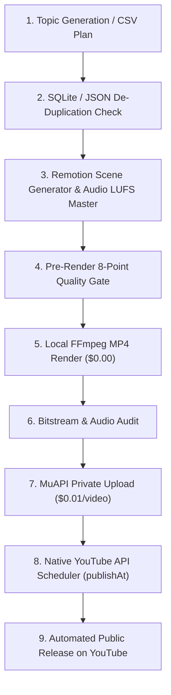

# YouTube Shorts & Video Automation Engine (MuAPI + Official YouTube API)

[](LICENSE)
[](https://nodejs.org)
[](https://remotion.dev)

A production-ready, automated pipeline for creating, validating, uploading, and scheduling 9:16 vertical science explainer shorts and music visualizers using **Remotion**, **MuAPI**, and the official **Google YouTube Data API v3**.



---

## 🌟 Key Features

* **Topic Idea Generator & CSV Importer**: Provide a CSV master plan or specify a general niche (e.g., *"Space Mysteries"*), and the engine handles topic generation.
* **Smart De-Duplication Database**: Built-in zero-dependency database tracker (`database/tracker.json`) that performs fuzzy normalized title matching and concept keyword overlap checks to **prevent duplicate topics**.
* **Action-First Pacing**: Visual action starts within **<0.5s**, title overlays last **<1.5s**, and explanatory visual scenes change every **0.8s–2.0s**.
* **Credit & Cost Optimization**:
  * **Codex Native Image Generation**: Uses native image generation for covers, stills, and thumbnails to save MuAPI credits.
  * **Local FFmpeg Processing**: Video rendering, composition, and EBU R128 audio mastering (-16 LUFS) are performed locally for $0.00 extra cost.
* **Hybrid YouTube Upload & Native Scheduling**:
  * **Upload**: Immediate private upload via MuAPI (`privacy: "private"`, $0.01 per video).
  * **Schedule**: Official YouTube Data API v3 (`videos.update` with `status.publishAt`, 50 API units per video).
* **Dual-Variant Suno Music Video Skill**: Dedicated skill for Suno AI music production, preserving dual variants, creating distinct cover artwork, and outputting 16:9 landscape and 9:16 vertical videos.

---

## 🛠️ Project Structure

```
.
├── .gitignore                      # Excludes API keys, secrets, logs, & heavy media
├── 50_engaging_science_video_master_plan.csv  # 50 Science Explainer Master Plan
├── AGENTS.md                       # Workspace production rules & standards
├── README.md                       # Repository documentation
├── workflow.md                     # Detailed technical workflow guide
├── database/
│   ├── db.mjs                      # Atomic database engine (topics, videos, schedules)
│   └── tracker.json                # Seeded database store
├── skills/
│   ├── muapi-youtube-automation/   # Main Shorts production & scheduling skill
│   └── muapi-suno-music-video/     # Suno Music Video & visualizer skill
└── video-factory/                  # Remotion monorepo & project assets
    └── packages/remotion/          # React Three Fiber, SVG, and Shader comps
```

---

## 🚀 Quick Start Guide

### 1. Prerequisites
- **Node.js**: v20.0 or higher
- **FFmpeg**: Installed locally and available in `PATH`

### 2. Environment Setup
Create a `.youtube-credentials.json` file in `video-factory/`:
```json
{
  "client_id": "YOUR_GOOGLE_CLIENT_ID.apps.googleusercontent.com",
  "client_secret": "YOUR_GOOGLE_CLIENT_SECRET",
  "refresh_token": "1//YOUR_REFRESH_TOKEN"
}
```

### 3. Execution Commands

```bash
# 1. Preview compositions in Remotion Studio
npm run dev

# 2. Check MuAPI balance & connected YouTube channel
node scratch/check-muapi-publishing-info.mjs

# 3. Verify Google OAuth YouTube channel connection
node scratch/test-youtube-credentials.mjs

# 4. Upload finished MP4s to YouTube as private ($0.01/video)
node scratch/upload-remaining-40.mjs

# 5. Audit all uploaded videos on YouTube via Official API
node scratch/audit-all-50-youtube-status.mjs

# 6. Batch schedule private videos (1 every 30 mins)
node scratch/schedule-39-every-30min.mjs
```

---

## 🔒 Security & Privacy Notice

This repository enforces strict secret management:
- API keys, OAuth tokens, and `.youtube-credentials.json` are explicitly ignored in `.gitignore`.
- No sensitive user credentials or private API tokens are committed to repository history.

---

## 📄 License

Distributed under the **MIT License**. See `LICENSE` for more information.
